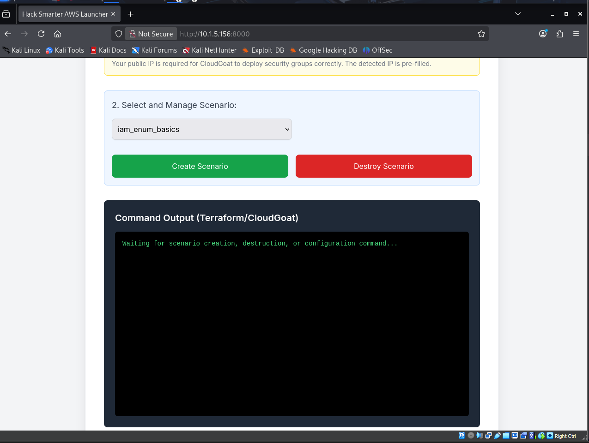
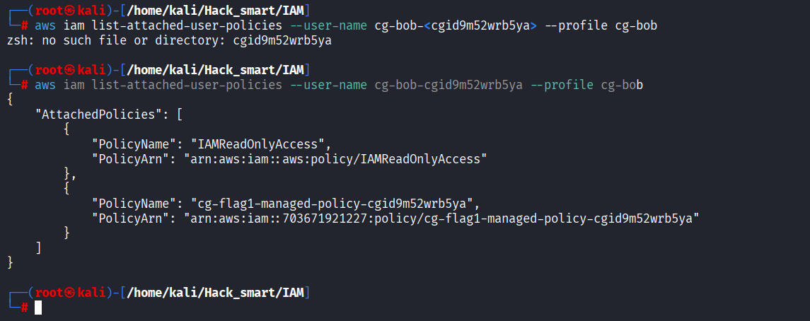
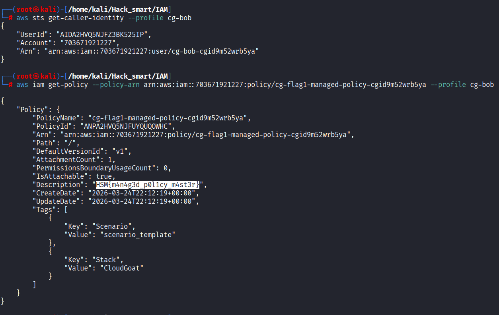
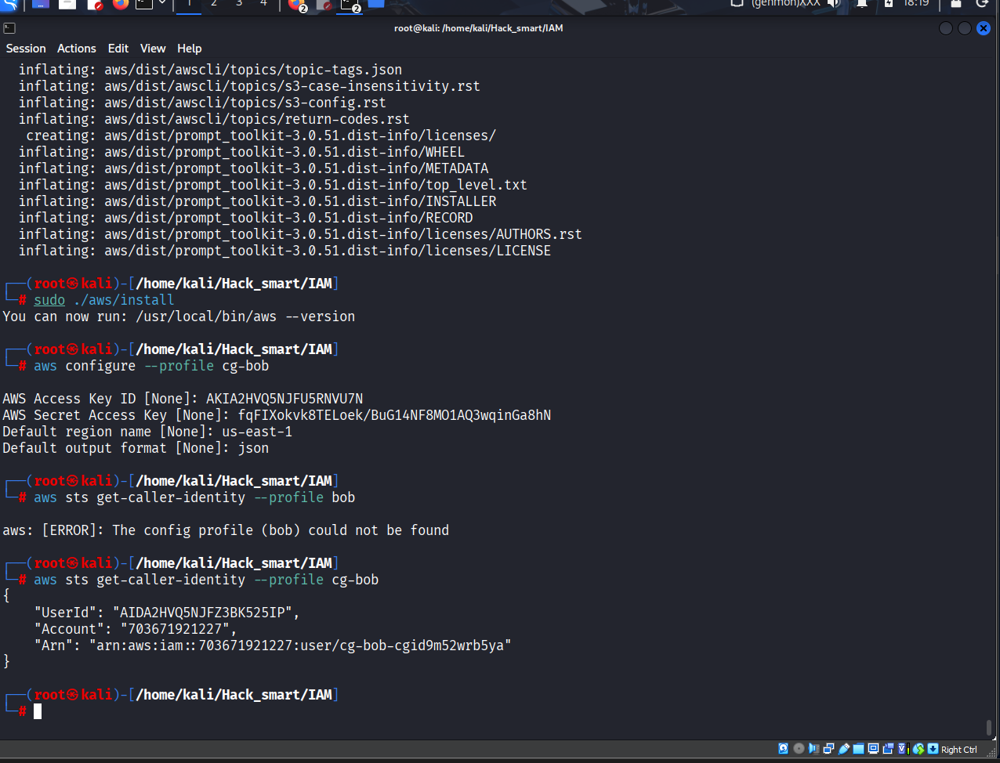
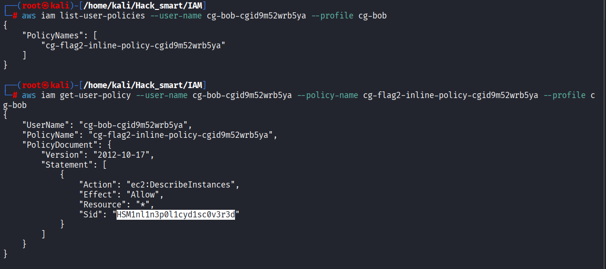

# HackSmarter — AWS IAM Enumeration Writeup

## Overview
This assessment focused on mapping AWS Identity and Access Management (IAM) from a low-privileged starting point and building a reliable permission picture before attempting anything noisy. We identified AWS access key and secret key for a low-privileged user named **Bob**, validated the active identity, and then expanded visibility from the user into groups, roles, and policy documents.

The main outcome was not a “single trick,” but a structured IAM map: who can do what, through which policy type, and under which trust relationship.



## Why IAM matters in AWS security
In AWS, IAM is the control plane for identity and authorization. If compute, storage, or data services are the infrastructure, IAM is the decision engine that gates access to all of it.

For defenders, IAM is where weak assumptions become exposure:
- broad wildcard actions (`iam:*`, `s3:*`)
- high-risk privilege paths (`iam:PassRole`, `sts:AssumeRole`)
- stale policy versions with permissive legacy statements
- confusing inheritance between user, group, and role attachments

A careful IAM review surfaces real attack paths and also produces concrete remediation items.

## Initial access and identity validation
We started with API credentials associated with a low-privileged IAM user (`bob`) and configured a dedicated local CLI profile with redacted values.

```bash
aws configure --profile bob
# AWS Access Key ID [None]: AKIA************
# AWS Secret Access Key [None]: ********************************
# Default region name [None]: us-east-1
# Default output format [None]: json
```

Then we validated the active identity and account scope:

```bash
aws sts get-caller-identity --profile bob
```

At this point we had three important anchors:
1. the **account ID** we were operating in
2. the **principal ARN** (`arn:aws:iam::<account-id>:user/bob`)
3. confidence that subsequent results reflected Bob’s effective permissions

## Core IAM concepts used during the assessment
The following concepts were central during enumeration:

- **Users**: long-lived IAM identities (like Bob) with direct credentials.
- **Groups**: containers of users; permissions are inherited from attached policies.
- **Roles**: assumable identities, typically used by services or federated identities.
- **Managed policies**: reusable policy documents attached to users/groups/roles.
- **Inline policies**: embedded policies attached directly to one principal.
- **Trust policies**: role-side policies defining *who can assume* the role.
- **Policy versions**: managed policies can keep multiple versions; one is default/active.
- **Effect / Action / Resource / Sid**:
  - `Effect`: Allow or Deny
  - `Action`: API calls permitted/blocked
  - `Resource`: AWS resources in scope
  - `Sid`: optional statement ID for tracking intent

## Managed policy enumeration
We first checked managed policies attached directly to Bob:

```bash
aws iam list-attached-user-policies \
  --user-name bob \
  --profile bob
```

Then we pulled each policy document for review:

```bash
aws iam get-policy \
  --policy-arn arn:aws:iam::<account-id>:policy/<policy-name> \
  --profile bob

aws iam get-policy-version \
  --policy-arn arn:aws:iam::<account-id>:policy/<policy-name> \
  --version-id v1 \
  --profile bob
```

This showed where Bob had direct visibility and where permissions were inherited indirectly through groups.



## Inline policy enumeration
Inline policies are easy to miss because they are not reusable objects and do not appear in managed-policy listings.

User-level inline check:

```bash
aws iam list-user-policies --user-name bob --profile bob
aws iam get-user-policy \
  --user-name bob \
  --policy-name <inline-policy-name> \
  --profile bob
```

We repeated this pattern for groups and roles discovered later in the process to avoid blind spots.

## Group membership enumeration
Next, we mapped Bob’s group memberships and then expanded into group-attached policies.

```bash
aws iam list-groups-for-user --user-name bob --profile bob

aws iam list-attached-group-policies \
  --group-name <group-name> \
  --profile bob

aws iam list-group-policies \
  --group-name <group-name> \
  --profile bob
```

This is where effective permissions often become broader than expected: users may look constrained individually but inherit powerful actions from a group.



## Role enumeration
After user and group mapping, we pivoted into role inventory and trust analysis.

```bash
aws iam list-roles --profile bob

aws iam get-role \
  --role-name <role-name> \
  --profile bob

aws iam list-attached-role-policies \
  --role-name <role-name> \
  --profile bob

aws iam list-role-policies \
  --role-name <role-name> \
  --profile bob
```

We reviewed role trust policies carefully to understand who could assume each role and whether role chaining might exist.



## Managed policy version review
Managed policy versioning can hide risk if older permissive versions still exist and a principal can switch defaults.

```bash
aws iam list-policy-versions \
  --policy-arn arn:aws:iam::<account-id>:policy/<policy-name> \
  --profile bob

aws iam get-policy-version \
  --policy-arn arn:aws:iam::<account-id>:policy/<policy-name> \
  --version-id v2 \
  --profile bob
```



Key checks during version review:
- Is the default version the most restrictive current intent?
- Do non-default versions contain broader legacy permissions?
- Does any principal have rights to set default policy version?

## Key findings
- Starting from a low-privileged user still allowed meaningful IAM visibility and relationship mapping.
- Effective permissions were distributed across direct user policies and inherited group policies.
- Role trust relationships provided high-value context for potential lateral movement paths.
- Policy version history required review to ensure older broad statements were not reactivatable.

## Troubleshooting notes
- **`AccessDenied` noise**: treated as signal, not failure. Denials helped map permission boundaries.
- **Pagination gaps**: some IAM lists required handling pagination to avoid incomplete inventory.
- **JSON readability**: piping output through `jq` made policy statements much faster to review.
- **Profile confusion**: using explicit `--profile bob` prevented accidental use of default credentials.

## Commands used
```bash
# Identity and baseline
aws sts get-caller-identity --profile bob
aws iam get-account-summary --profile bob

# User-focused enumeration
aws iam list-users --profile bob
aws iam list-attached-user-policies --user-name bob --profile bob
aws iam list-user-policies --user-name bob --profile bob
aws iam get-user-policy --user-name bob --policy-name <inline-policy-name> --profile bob

# Group-focused enumeration
aws iam list-groups --profile bob
aws iam list-groups-for-user --user-name bob --profile bob
aws iam list-attached-group-policies --group-name <group-name> --profile bob
aws iam list-group-policies --group-name <group-name> --profile bob
aws iam get-group-policy --group-name <group-name> --policy-name <inline-policy-name> --profile bob

# Role-focused enumeration
aws iam list-roles --profile bob
aws iam get-role --role-name <role-name> --profile bob
aws iam list-attached-role-policies --role-name <role-name> --profile bob
aws iam list-role-policies --role-name <role-name> --profile bob
aws iam get-role-policy --role-name <role-name> --policy-name <inline-policy-name> --profile bob

# Managed policy drilldown
aws iam get-policy --policy-arn arn:aws:iam::<account-id>:policy/<policy-name> --profile bob
aws iam list-policy-versions --policy-arn arn:aws:iam::<account-id>:policy/<policy-name> --profile bob
aws iam get-policy-version --policy-arn arn:aws:iam::<account-id>:policy/<policy-name> --version-id v1 --profile bob
```

## What I learned
This walkthrough reinforced that cloud enumeration is most effective when it is relationship-driven, not command-driven. Enumerating users, groups, roles, and policy versions as connected objects made permission inheritance and potential escalation routes much clearer than isolated checks.

## Final takeaways
This writeup captures a practical IAM assessment pattern: validate identity, map principals, inspect policy sources, and confirm effective permissions before making conclusions. That approach scales well from labs to real environments.

I’ll keep this same documentation style for upcoming cloud writeups so the portfolio stays consistent, technically honest, and useful for both blue-team and offensive security readers.
